# Production Analytics Design

How this analysis becomes a system leadership can trust daily. The design goal is narrow and
specific: **make the error that produced the phantom 11% structurally impossible to repeat.**

---

## 1. Pipeline

```mermaid
flowchart LR
  subgraph SRC["Source systems"]
    D1[Dialer / telephony]:::src
    D2[CRM / accounts]:::src
    D3[Payment gateway]:::src
    D4[WhatsApp / SMS]:::src
    D5[Field app]:::src
  end

  SRC -->|CDC, append-only| RAW

  subgraph PIPE["Warehouse"]
    RAW["<b>raw</b><br/>all TEXT · nothing rejected<br/>partitioned by ingest_date"]:::raw
    STG["<b>staging</b><br/>typed · timezone-normalised<br/><i>1:1 with raw</i>"]:::stg
    CLN["<b>clean</b><br/>dedup · entity resolution<br/>validity rules"]:::cln
    GLD["<b>golden</b><br/>conformed facts + dims<br/>declared grain"]:::gld
    MET["<b>metrics</b><br/>certified definitions<br/><i>per-day only</i>"]:::met
  end

  RAW --> STG --> CLN --> GLD --> MET
  CLN -.->|every removed row| REJ["<b>reject.ledger</b><br/>reason code + ₹ impact"]:::rej
  MET --> DASH["Executive dashboard"]:::out
  MET --> API["Metric API / BI"]:::out
  REJ --> DQ["DQ monitor"]:::out

  classDef src fill:#eef3fb,stroke:#2a78d6,color:#0f1419
  classDef raw fill:#f5f5f3,stroke:#8a949f,color:#0f1419
  classDef stg fill:#eaf1fc,stroke:#2a78d6,color:#0f1419
  classDef cln fill:#e3edfb,stroke:#2a78d6,color:#0f1419
  classDef gld fill:#dbe8fa,stroke:#1c5cab,color:#0f1419
  classDef met fill:#d0e0f8,stroke:#184f95,color:#0f1419
  classDef rej fill:#fdecec,stroke:#d03b3b,color:#0f1419
  classDef out fill:#fdefe8,stroke:#eb6834,color:#0f1419
```



Each layer has exactly one job, and the boundary between them is a contract:

| Layer | Job | Invariant |
|---|---|---|
| `raw` | Land bytes | Row count equals the source file. Nothing rejected, ever. |
| `staging` | Fix representation | `count(stg.x) = count(raw.x)`. Asserted; build fails otherwise. |
| `clean` | Fix meaning | Every removal has a ledger row. `raw − rejected = clean`. |
| `golden` | Conform | Grain declared and enforced by a primary key. |
| `metrics` | Certify | No metric may expose an un-normalised monthly total. |

## 2. Data contracts

Enforced at the `raw → staging` boundary, versioned in git, breaking changes require a PR:

```yaml
table: payments
owner: payments-platform
sla: { freshness: 2h, completeness: 99.5% }
schema:
  payment_id:        { type: string, required: true }
  account_id:        { type: string, required: true, foreign_key: accounts.account_id }
  amount:            { type: decimal(14,2), required: true, min: 0 }
  payment_status:    { type: enum[SUCCESS,FAILED,PENDING,REVERSED], required: true }
  payment_reference: { type: string, required: false, unique: false }   # NOT unique -- see DQ 3.1
  event_at:          { type: timestamp, required: true, timezone: required }
expectations:
  - payment_id is unique after dedup on the identity columns
  - event_at within [ingest_date - 30d, ingest_date + 1d]
  - reversal_ratio_30d < 0.10
```

The `unique: false` on `payment_reference` is deliberate and carries a comment. Contracts are where
hard-won knowledge should live, so the next analyst does not re-learn it at ₹25.01 Cr of risk.

## 3. Primary keys and grain

| Table | Grain | Key | Note |
|---|---|---|---|
| `golden.dim_account` | one row per account | `account_id` | status from the event log, snapshot retained |
| `golden.dim_borrower` | one row per resolved borrower | `borrower_id` | latest version; fields never merged |
| `golden.fct_payment` | one row per payment event | `payment_id` | after identity-column dedup |
| `golden.fct_call` | one row per call | `call_id` | after dedup + timestamp-conflict collapse |
| `golden.fct_touch` | one row per outreach event | `(channel, account_id, event_at_utc)` | calls + WhatsApp + SMS + field, unioned |
| `golden.dim_date` | one row per calendar day | `date_ist` | **carries `days_in_month`** |

`dim_date` is not boilerplate. Joining every fact to a date dimension that carries `days_in_month`
is what makes per-day normalisation the path of least resistance rather than an extra step someone
forgets.

`fct_touch` exists for one reason: a never-contacted baseline computed on calls alone counts an
account that received WhatsApp, SMS and a field visit as untouched. Every channel-effect question
must run against the unioned table or the control group is contaminated by construction.

## 4. Metric definitions as code

Metrics live in one versioned registry, not in dashboard tiles. A metric that cannot be computed
reliably is *registered as unusable* rather than quietly omitted — silence is how a broken metric
stays in a board pack for years.

```yaml
- id: net_recovery_per_day
  sql: (sum(amount) filter (where status='SUCCESS')
        - sum(amount) filter (where status='REVERSED')) / count(distinct date_ist)
  grain: day
  forbid_aggregation: [month_total]     # blocks the phantom-11% error at the semantic layer
  owner: collections-analytics

- id: ptp_kept_rate
  status: UNUSABLE
  reason: >
    Status field carries no information: KEPT converts at 7.75% vs BROKEN at 6.63%
    against a 70-90% benchmark. Blocked until the source field is fixed.

- id: rpc_rate
  status: UNUSABLE
  reason: >
    No party-identification field exists. WRONG_NUMBER is assigned independently of
    call outcome and sits on calls that never connected 61.3% of the time.

- id: cost_per_rupee_recovered
  status: UNUSABLE
  reason: >
    No cost data exists in the extract, and attributed amount swings 26x
    (3.26% to 83.42% of payments) purely on the choice of attribution window.
```

Three of ten metrics are registered UNUSABLE. That is the point: the registry records what cannot
be measured as explicitly as what can.

## 5. Incremental processing, late data and backfills

- **Incremental by `ingest_date`,** never by `event_at` — events arrive late (this dataset's calls
  extend 4 days past every other table).
- **Late-arriving window: 30 days.** Each night, re-process the trailing 30 days rather than only
  yesterday. Costs little; prevents silently-wrong history. Sized from the observed lag
  distribution in `account_status_history`, not chosen by convention.
- **Backfills are additive.** A backfill writes a new partition version and flips a pointer; it
  never mutates in place. `account_status_history` in the source shows what in-place mutation
  costs — 50.3% of rows recorded before the event they describe.
- **Idempotency.** Every layer is a pure function of the layer below plus the run date. Re-running
  any day produces byte-identical output. Ties in dedup are broken by a documented, deterministic
  rule (stable sort on source row order), so "re-running produces the same file" is a guarantee,
  not a hope.

## 6. Data-quality checks

Blocking checks fail the build; warning checks page the owner but let data through.

| Check | Type | Threshold |
|---|---|---|
| `count(stg) = count(raw)` per table | **Blocking** | exact |
| `raw − rejected = golden` per entity | **Blocking** | exact |
| Primary key uniqueness on every golden table | **Blocking** | exact |
| Timezone-null rate on new events | **Blocking** | > 0% |
| Rejection rate per reason code | Warning | > 2× 30-day median |
| Reversal ratio | Warning | > 10% |
| Foreign-key orphans | Warning | > 0.1% |
| Distinct `agent_id` per `employee_code` | Warning | > 1 |

## 7. Monitoring and anomaly detection

Three tiers, deliberately ordered — most production "anomaly detection" fails because tier 1 was
skipped in favour of tier 3.

1. **Freshness and volume.** Did the data arrive, and is the row count within its usual band?
   Catches the majority of real incidents.
2. **Distributional drift.** Population Stability Index on segment mix, DPD band and channel mix
   against a trailing 90-day baseline; alert at PSI > 0.2.
3. **Metric-level anomaly.** Seasonal-naive forecast on the **per-day** series with a 3σ band.
   Explicitly per-day: an anomaly detector on monthly totals would have flagged March 2026 as a
   genuine 11% improvement.

Every alert carries the ledger delta, so the first question an on-call analyst can answer is
"did something change in the business, or in the pipeline?"

## 8. What this design would have prevented

| Failure | Control that stops it |
|---|---|
| Phantom +11% | `forbid_aggregation: [month_total]` in the metric registry; `dim_date.days_in_month` |
| ₹25.01 Cr destroyed by naive dedup | `unique: false` on `payment_reference` in the contract |
| Silent loss of malformed rows | `raw` is all-TEXT; staging row-count assertion |
| Untraceable cleaning decisions | `reject.ledger` + the reconciliation assertion |
| PTP forecasts built on a dead field | Metric registered `UNUSABLE` with a stated reason |
| Wrong-day operational reports | Timezone required at contract level, blocking check |
| Contaminated control groups | `golden.fct_touch` unions every channel; calls-only baselines are unavailable by construction |
| Non-reproducible golden tables | Deterministic tie-break rule; re-run produces identical bytes |
